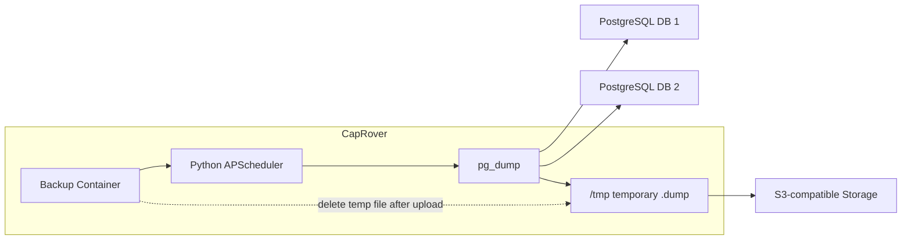

# CapRover PostgreSQL S3 備份服務

這是一個可部署在 CapRover 的 Python 備份服務。它會定時使用 `pg_dump -Fc` 備份一個或多個 PostgreSQL database，並把 `.dump` 檔上傳到 S3-compatible storage，例如 NAS 上的 MinIO。

## 網路架構

備份容器需要能連到 PostgreSQL 和 S3-compatible endpoint。請在 `DATABASES_JSON` 的 `host` 填入容器可連線的 PostgreSQL host，並在 `S3_ENDPOINT` 填入容器可連線的 S3 endpoint。



## 備份流程

1. 容器啟動後讀取 ENV，建立 S3 client，並依 `RUN_ON_START` 決定是否立即備份一次。
2. `APScheduler` 在 Python process 內依 `BACKUP_CRON` 觸發備份，不需要 Linux `cron` daemon。
3. 每次備份會逐一讀取 `DATABASES_JSON` 裡的 database 設定。
4. 容器內執行 PostgreSQL client 18 的 `pg_dump -Fc`，把每個 database dump 成 `/tmp` 裡的暫存 `.dump` 檔。
5. `pg_dump` 成功後才上傳到 S3-compatible storage，最後刪除 `/tmp` 暫存檔。

## PostgreSQL Client 版本

此 image 固定安裝 PostgreSQL client 18，備份時會執行：

```text
/usr/lib/postgresql/18/bin/pg_dump
```

`pg_dump` 的 major version 會影響相容性。建議 `pg_dump` major version 等於或高於 PostgreSQL server major version。此 image 主要針對 PostgreSQL 18 database 使用。

## CapRover ENV 範例

以下可以直接複製到 CapRover App Configs 的 Environment Variables，再把 placeholder 改成你的實際值：

```env
BACKUP_CRON=0 3 * * *
TZ=Asia/Taipei
RUN_ON_START=true
LOG_LEVEL=INFO

S3_ENDPOINT=http://s3.example.local:9000
S3_ACCESS_KEY=change-me
S3_SECRET_KEY=change-me
S3_BUCKET=postgres-backups
S3_REGION=us-east-1
S3_PREFIX=caprover
S3_FORCE_PATH_STYLE=true
S3_SECURE=false

DATABASES_JSON=[{"name":"app1","host":"postgres-1.example.local","port":5432,"database":"app1_db","username":"postgres","password":"change-me"},{"name":"app2","host":"postgres-2.example.local","port":5432,"database":"app2_db","username":"postgres","password":"change-me"}]
```

## ENV 參數說明

必填 ENV：`BACKUP_CRON`、`S3_ENDPOINT`、`S3_ACCESS_KEY`、`S3_SECRET_KEY`、`S3_BUCKET`、`DATABASES_JSON`。

選填 ENV：`TZ`、`RUN_ON_START`、`LOG_LEVEL`、`S3_REGION`、`S3_PREFIX`、`S3_FORCE_PATH_STYLE`、`S3_SECURE`。未設定時會使用下表預設值。

| 參數 | 必填 | 預設值 | 說明 | 範例 |
| --- | --- | --- | --- | --- |
| `BACKUP_CRON` | 是 | 無 | 備份排程，使用 cron 表達式。時間會依 `TZ` 解讀。 | `0 3 * * *` |
| `TZ` | 否 | `UTC` | 排程與備份檔 timestamp 使用的時區。 | `Asia/Taipei` |
| `RUN_ON_START` | 否 | `false` | 容器啟動後是否立即跑一次備份。 | `true` |
| `LOG_LEVEL` | 否 | `INFO` | Python logging 等級。 | `INFO` |
| `S3_ENDPOINT` | 是 | 無 | S3-compatible endpoint URL。 | `http://s3.example.local:9000` |
| `S3_ACCESS_KEY` | 是 | 無 | S3 access key。 | `change-me` |
| `S3_SECRET_KEY` | 是 | 無 | S3 secret key。 | `change-me` |
| `S3_BUCKET` | 是 | 無 | 備份檔要上傳到的 bucket。 | `postgres-backups` |
| `S3_REGION` | 否 | `us-east-1` | S3 region；MinIO 通常可用 `us-east-1`。 | `us-east-1` |
| `S3_PREFIX` | 否 | 空字串 | S3 object key 前綴。留空時路徑會直接從 database name 開始。 | `caprover` |
| `S3_FORCE_PATH_STYLE` | 否 | `true` | 是否使用 path-style S3 URL；MinIO 建議設為 `true`。 | `true` |
| `S3_SECURE` | 否 | `true` | S3 client 是否使用 HTTPS。HTTP endpoint 請設為 `false`。 | `false` |
| `DATABASES_JSON` | 是 | 無 | PostgreSQL database 清單，JSON array 格式。 | 見下方範例 |

## DATABASES_JSON 格式

```json
[
  {
    "name": "app1",
    "host": "postgres-1.example.local",
    "port": 5432,
    "database": "app1_db",
    "username": "postgres",
    "password": "change-me"
  }
]
```

欄位說明：

| 欄位 | 必填 | 型別 | 說明 | 範例 |
| --- | --- | --- | --- | --- |
| `name` | 是 | string | 備份識別名稱，會用在 log 和 S3 路徑。 | `app1` |
| `host` | 是 | string | PostgreSQL host，可填 CapRover service name、內網 IP、DNS 名稱或任何容器可連線的位址。 | `postgres-1.example.local` |
| `port` | 是 | integer | PostgreSQL port，必須是 `1..65535`。 | `5432` |
| `database` | 是 | string | 要備份的 database 名稱。 | `app1_db` |
| `username` | 是 | string | PostgreSQL 使用者。 | `postgres` |
| `password` | 是 | string | PostgreSQL 密碼。 | `change-me` |

## 備份路徑

備份檔會上傳到：

```text
s3://{S3_BUCKET}/{S3_PREFIX}/{db_name}/{yyyymmdd}/{db_name}-{timestamp}.dump
```

範例：

```text
s3://postgres-backups/caprover/app1/20260601/app1-20260601-030000.dump
```

## 還原方式

先從 S3/MinIO 下載 `.dump` 檔，再用 `pg_restore` 還原：

```bash
pg_restore -h <host> -U <user> -d <database> backup.dump
```

## CapRover 部署

此 repo 已包含 `captain-definition` 和 `Dockerfile`，可直接部署到 CapRover。

部署後在 CapRover app 的 Environment Variables 填入上方 ENV。此服務不需要 persistent volume，因為備份檔只會暫存在容器 `/tmp`，上傳完成或失敗後都會清除。

也可以直接使用 GitHub Container Registry image：

```text
ghcr.io/markx2008/caprover-db-backup:latest
```

推送到 `master` 時 GitHub Actions 會發布：

```text
ghcr.io/markx2008/caprover-db-backup:latest
ghcr.io/markx2008/caprover-db-backup:sha-<short-sha>
```

推送 `v*.*.*` tag 時會發布對應版本 tag。

## 注意事項

- 備份容器本身只負責排程、`pg_dump` 和 S3 上傳；網路連線能力由部署環境提供。
- image 內固定使用 PostgreSQL client 18。
- ENV 使用通用 `S3_` 命名。
- 服務不會刪除舊備份；保留策略請在 NAS、MinIO 或 S3 lifecycle 設定。
- 單一 database 備份失敗不會中斷其他 database 的備份。
